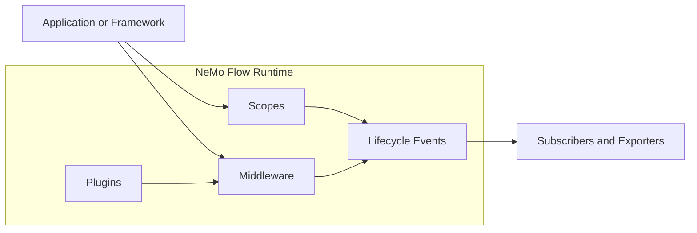

<!--
SPDX-FileCopyrightText: Copyright (c) 2026, NVIDIA CORPORATION & AFFILIATES. All rights reserved.
SPDX-License-Identifier: Apache-2.0
-->

# NeMo Flow

## What Is NeMo Flow?

NeMo Flow is a portable execution runtime for agent systems that already have a
framework, model provider, policy layer, or observability backend. It gives those
systems one consistent way to describe, control, and observe what happens when an
agent crosses a request, tool, or LLM boundary.

Agent applications rarely live inside one clean abstraction. A production stack
might combine NeMo Agent Toolkit, LangChain, LangGraph, provider SDKs, custom
harness code, NeMo Guardrails, tracing systems, and evaluation pipelines. NeMo
Flow sits underneath those choices as the shared runtime contract for scopes,
middleware, plugins, lifecycle events, adaptive behavior, and observability.

Built as a Rust core with primary Rust, Python, and Node.js bindings, NeMo Flow
lets applications keep their orchestration model while runtime behavior stays
consistent across frameworks and languages.

## Why Use It?

- 🧭 **Own execution context across the whole agent run**: Hierarchical scopes
  attach tools, LLM calls, middleware, subscribers, and events to the same
  parent-child execution tree.
- 🛡️ **Package policy once**: Guardrails and intercepts can block work, sanitize
  observability payloads, transform requests, or wrap execution without
  rewriting every call site.
- 📡 **Emit one lifecycle stream**: Subscribers consume canonical runtime events
  in-process or export them as [ATIF v1.6](https://github.com/harbor-framework/harbor/blob/main/rfcs/0001-trajectory-format.md)
  trajectories, OpenTelemetry traces, or OpenInference-compatible traces.
- 🧩 **Integrate without a framework migration**: NeMo Flow can sit below NeMo
  ecosystem components, third-party agent frameworks, provider adapters, or
  direct application code.
- ⚙️ **Install reusable runtime behavior**: Plugins configure middleware,
  subscribers, adaptive components, and custom runtime behavior from one shared
  system.

## What You Get

- ✅ **Managed tool and LLM execution**: Run call boundaries through consistent
  lifecycle helpers and middleware ordering.
- ✅ **Concurrent request isolation**: Keep request-local middleware and
  subscribers attached to the scope that owns them, then clean them up when that
  scope closes.
- ✅ **Multi-language semantics**: Use the same runtime model from Rust, Python,
  and Node.js.
- ✅ **Observability-ready events**: Preserve model metadata, tool call IDs,
  inputs, outputs, scope relationships, and lifecycle timing for downstream
  analysis.
- ✅ **Extension points for framework authors**: Wrap stable tool and provider
  callbacks while preserving framework-owned scheduling, retries, memory, and
  result handling.



## Installation

Install the published package for your language:

```bash
# Rust
cargo add nemo-flow

# Python
uv add nemo-flow

# Node.js
npm install nemo-flow-node
```

For source builds, testing, and contribution workflow, see [CONTRIBUTING.md](CONTRIBUTING.md).

## Documentation

End-user documentation lives at [nvidia.github.io/NeMo-Flow](https://nvidia.github.io/NeMo-Flow/).

The primary documentation track covers Rust, Python, and Node.js.

The Go, WASM, and raw FFI surfaces are currently experimental and remain source-first under
`go/nemo_flow`, `crates/wasm`, and `crates/ffi`.

## Binding Status

The table below summarizes the support level for each binding surface.

| Binding | Status | Notes |
|---|---|---|
| Python | ✅ Fully Supported | Fully documented with Quick Start and Guides |
| Node.js | ✅ Fully Supported | Fully documented with Quick Start and Guides  |
| Rust | ✅ Fully Supported | Fully documented with Quick Start and Guides  |
| Go | 🚧 Experimental | Source-first under `go/nemo_flow`. |
| WASM | 🚧 Experimental | Source-first under `crates/wasm`. |
| FFI | 🚧 Experimental | Source-first under `crates/ffi`. |

## Third-Party Integrations

Some framework integrations are maintained as patch sets against upstream
projects rather than as packages in this repository.

Use [third_party/README.md](third_party/README.md) for the clone, checkout, and
patch-application workflow for those integrations.

## License

NeMo Flow is licensed under the [Apache License 2.0](LICENSE). All source files must include SPDX license headers.
