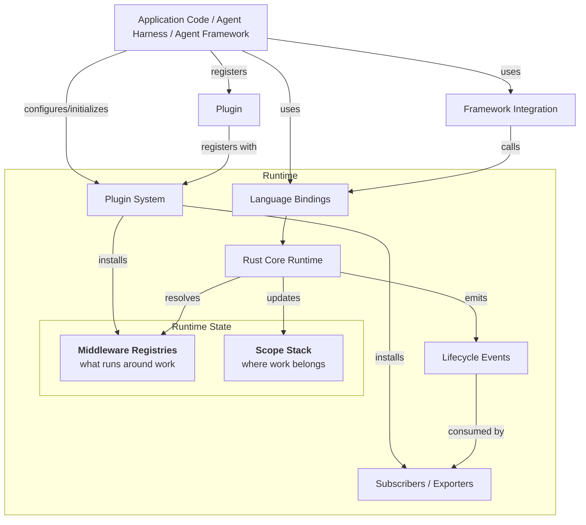

import { MermaidStyles } from "@/components/MermaidStyles";

{/* SPDX-FileCopyrightText: Copyright (c) 2026, NVIDIA CORPORATION & AFFILIATES. All rights reserved.
SPDX-License-Identifier: Apache-2.0 */}

NeMo Relay is a portable execution runtime for agent systems that already have a
framework, model provider, policy layer, or observability backend. It gives those
systems one consistent way to describe what is happening when an agent crosses a
request, tool, or LLM boundary.

That layer is useful because agent applications rarely live inside one clean
abstraction. A production stack might combine NeMo Agent Toolkit, LangChain,
LangGraph, provider SDKs, custom harness code, NeMo Guardrails, tracing systems,
and evaluation pipelines. NeMo Relay sits underneath those choices as the shared
runtime contract for scopes, middleware, plugins, lifecycle events, adaptive
behavior, and observability. Under the NeMo Relay scope stack and middleware, the scoped execution path is referred to as work.

The result is a framework-neutral substrate for agent execution. Applications
keep their orchestration model, providers keep their native clients, and
middleware authors get one place to package policy, interception, telemetry, and
adaptive behavior across Rust, Python, and Node.js.

## Benefits

NeMo Relay is designed for teams that need agent runtime behavior to stay
consistent as applications grow across frameworks, languages, and deployment
targets.

- **Instrument once at the execution boundary**: Managed tool and LLM helpers
  attach work to the active scope, emit lifecycle events, and run the same
  middleware pipeline without scattering custom wrappers through every call site.
- **Keep concurrent agents isolated**: Hierarchical scopes preserve parent-child
  event relationships, expose request-local middleware and subscribers, and
  clean up scope-owned registrations when work finishes.
- **Turn policy into reusable runtime components**: Guardrails and intercepts can
  block work, sanitize observability payloads, transform requests, or wrap
  execution. Plugins package that behavior so applications and framework
  integrations can install it from configuration.
- **Export one event stream to many backends**: Subscribers consume the canonical
  lifecycle stream in-process or translate it to Agent Trajectory Interchange
  Format (ATIF) trajectories, OpenTelemetry traces, and OpenInference-compatible
  traces for debugging, evaluation, and production observability.
- **Adopt without replacing the stack**: NeMo Relay can sit below NeMo ecosystem
  components, third-party agent frameworks, provider adapters, or direct
  application code, so teams can add shared runtime semantics without a
  framework migration.
- **Share semantics across primary bindings**: The Rust core, Python wrapper,
  and Node.js binding expose the same execution model, which helps framework
  authors, plugin authors, and application teams reason about behavior
  consistently.

## What Should I Read First?

Use the reading path that matches your task:

| Task | Start With |
|---|---|
| Understand what NeMo Relay adds | [Agent Runtime Primer](/getting-started/agent-runtime-primer) |
| Run a minimal example | [Quick Start](/getting-started/quick-start) |
| Install packages | [Installation](/getting-started/installation) |
| Develop from source | [Development Setup](/contribute/development-setup) |
| Understand the runtime model | [Concepts](/about-nemo-relay/concepts) |
| Instrument an application | [Instrument Applications](/instrument-applications/about) |
| Use a maintained integration | [Supported Integrations](/integrations/about) |
| Integrate a framework | [Integrate into Frameworks](/integrate-frameworks/about) |
| Observe a local coding-agent CLI | [NeMo Relay CLI](/nemo-relay-cli/about) |
| Package reusable behavior | [Build Plugins](/build-plugins/about) |
| Export traces or trajectories | [Observability](/plugins/observability/about) |
| Debug trace incidents | [Trace Incident Runbook](/resources/troubleshooting/trace-incident-runbook) |
| Tune performance with adaptive behavior | [Adaptive](/plugins/adaptive/about) |
| Look up symbols | [APIs](/reference/api) |

## Conceptual Diagram

The diagram below shows how applications, runtime components, and exporters
relate to each other. Scopes define where work belongs, middleware registries
define what runs around that work, and subscribers consume the lifecycle events
that the core emits.

<MermaidStyles />

