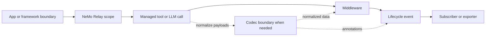

import { MermaidStyles } from "@/components/MermaidStyles";

{/* SPDX-FileCopyrightText: Copyright (c) 2026, NVIDIA CORPORATION & AFFILIATES. All rights reserved.
SPDX-License-Identifier: Apache-2.0 */}

NeMo Relay is a portable runtime layer for agent systems that already have an
application, framework, or model provider. Use this primer when you need to
understand what NeMo Relay adds before running [Quick Start](/getting-started/quick-start).

Agent applications usually cross several boundaries in one request: an entry
point starts work, the agent calls a model, the model asks for tools, tools call
services, and tracing or policy systems need to understand the result. Without a
shared runtime layer, each boundary tends to grow its own wrappers, callback
shape, trace vocabulary, and cleanup rules.

NeMo Relay gives those boundaries one execution model.

## What NeMo Relay Adds

NeMo Relay does not decide what your agent should do. It describes and manages
what happens when your agent crosses runtime boundaries.

The shared runtime model has five parts, with managed calls and codecs acting
as paths through that model rather than separate model layers:

- **Scopes** describe where work belongs. They preserve parent-child
  relationships across requests, agent runs, tools, LLM calls, background work,
  and nested functions.
- **Middleware** runs around managed execution. Intercepts can transform or wrap
  real calls. Guardrails can block execution or sanitize emitted observability
  payloads.
- **Plugins** package reusable runtime behavior so teams can install middleware,
  subscribers, exporters, or adaptive behavior from configuration instead of
  repeating setup code in every application.
- **Events** record what happened. NeMo Relay emits Agent Trajectory
  Observability Format (ATOF) lifecycle records that subscribers and exporters
  can consume.
- **Subscribers and exporters** consume events in process, write raw ATOF
  events, or project events into ATIF, OpenTelemetry, OpenInference, or other
  downstream formats.

Managed tool and LLM calls are the main application-owned API path through that
model: they attach work to the active scope, run middleware in a consistent
order, and emit lifecycle events. The application result is preserved unless
registered intercepts or guardrails intentionally change the execution path.

Codecs translate typed application values or provider-native payloads into
stable runtime shapes when request-side middleware, events, or exporters need
normalized data. They are boundary translators, not a separate execution model.

The simplest mental model is below. Codecs appear only when a boundary needs
payload normalization, so they are shown as an optional translator rather than a
required step for every call.

<MermaidStyles />

## What NeMo Relay Does Not Replace

NeMo Relay sits below the choices your application already makes.

It does not replace:

- Your agent framework or orchestration logic
- Your model provider or provider SDK
- Your application business logic
- Your production observability backend
- NeMo Agent Toolkit

Instead, it gives those systems a shared runtime contract for call boundaries,
policy hooks, event emission, and export.

## Find the Right Starting Point

Use this section as a router, not a setup checklist. Start from the destination
or outcome that matches your task; the linked page points you to the setup,
configuration, and validation steps for that path.

- **Direct Python, Node.js, or Rust application APIs:** Application code owns
  callback placement, provider authentication, and plugin initialization. Start
  with [Quick Start](/getting-started/quick-start), then use
  [Instrument Applications](/instrument-applications/about) when you own the
  tool or LLM call site.
- **LangChain, LangGraph, Deep Agents, or OpenClaw:** Start with
  [Supported Integrations](/supported-integrations/about) to choose the
  maintained path and support level. Local wiring still belongs to the
  application, framework, or OpenClaw plugin configuration.
- **New framework, orchestration, SDK, or provider integration:** The framework
  or adapter owns scheduling, retries, callbacks, and provider payloads. Start
  with [Integrate into Frameworks](/integrate-into-frameworks/about).
- **Local Claude Code, Codex, or Hermes runs:** The coding-agent harness
  owns invocation while Relay observes hooks, gateway-routed model traffic, and
  exporter output. Start with [NeMo Relay CLI](/nemo-relay-cli/about).
- **Reusable runtime behavior across services or teams:** Runtime plugin
  configuration owns reusable middleware, subscribers, exporters, model pricing,
  policy, or adaptive behavior. Start with [Build Plugins](/build-plugins/about),
  use [Observability](/observability-plugin/about) for export setup, and use
  [Adaptive](/adaptive-plugin/about) after baseline instrumentation is working.
