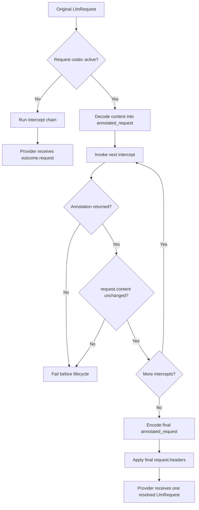

{/* SPDX-FileCopyrightText: Copyright (c) 2026, NVIDIA CORPORATION & AFFILIATES. All rights reserved.
SPDX-License-Identifier: Apache-2.0 */}

An LLM request intercept rewrites a request before managed execution. This page
describes the canonical outcome returned by each intercept, including how Relay
uses it to resolve the provider request and schedule lifecycle marks.

A canonical outcome serialization looks like this:

```json
{
  "request": {"headers": {}, "content": {}},
  "annotated_request": null,
  "pending_marks": []
}
```

`request` is required. `annotated_request` defaults to `null` when omitted on
input, and `pending_marks` defaults to an empty list. Canonical serialization
includes all three fields. A pending mark only contains `name`, optional
`category` and `category_profile`, and optional `data` and `metadata`. Relay
owns event UUIDs, parent UUIDs, and timestamps.

## Request Authority

The provider-body source of truth only depends on whether a request codec is
active:

Request codecs translate provider-specific request payloads into Relay's
normalized annotated request for intercepts, then encode accepted annotated
edits back into the provider request before execution. They normalize the
payload shape rather than translating between providers; response codecs are a
separate response-side path used to attach normalized data to lifecycle events.

| Request codec | Provider body source | Header source |
| --- | --- | --- |
| No codec | `outcome.request.content` | `outcome.request.headers` |
| Active codec | `outcome.annotated_request` | `outcome.request.headers` |

With an active codec, `request.content` is read-only context. Every intercept
must return an annotation and make provider-body changes through that
annotation, including its flattened `extra` fields for provider-specific data.
Relay rejects a changed raw body or missing annotation at the offending
intercept before invoking later middleware or creating an LLM lifecycle.

The following diagram shows how Relay resolves an intercept outcome before
managed execution.



## Binding Contract

The following callbacks return the same logical outcome in their native type
or object shape:

- Python callbacks return `LLMRequestInterceptOutcome`.
- Rust callbacks return `LlmRequestInterceptOutcome`.
- Go callbacks return `LLMRequestInterceptOutcome`.
- Node.js and WebAssembly callbacks return `{ request, annotated?, pendingMarks? }`.
  JavaScript pending-mark DTOs use `categoryProfile`; canonical JSON retains
  `pending_marks` and `category_profile`.
- Public C callbacks return one owned canonical outcome JSON string, and native
  ABI v1 callbacks return one host-owned outcome JSON string.
- Rust and Python `grpc-v1` worker SDKs return their canonical outcome in a
  `JsonEnvelope` with schema `nemo.relay.LlmRequestInterceptOutcome@1`.

The standalone request-intercept helper returns the complete outcome but does
not emit its pending marks because it does not own an LLM lifecycle.

## Managed Lifecycle

Managed execution runs all effective global and scope-local intercepts before
creating the LLM handle. Each accepted request and annotation pair feeds the
next intercept under the authority rules above, while pending marks append in
middleware order. A breaking intercept retains the marks it returned. If any
intercept fails or its boundary result is malformed, Relay discards all
accumulated marks and creates no LLM lifecycle.

After successful interception, Relay creates the handle and captures one
subscriber snapshot. It emits the LLM start at `T`, every pending mark at
`T + 1µs` in returned order with the LLM UUID as parent, and the LLM end no
earlier than `T + 1µs`. Streaming and non-streaming calls use the same rules.
Pending marks are never added to the provider request, annotated request,
codec input, sanitizer input, or start payload.

## Migration

This finalizes unpublished native ABI v1 and `grpc-v1` contracts. Rebuild all
development native plugins and workers. Replace tuple results, split C/Go
outputs, metadata envelopes, and parallel mark-aware registrations with the
canonical outcome and the existing `register_llm_request_intercept`
registration name.

## Related Topics

- [Tool Execution Intercept Outcomes](/reference/tool-execution-intercept-outcomes)
