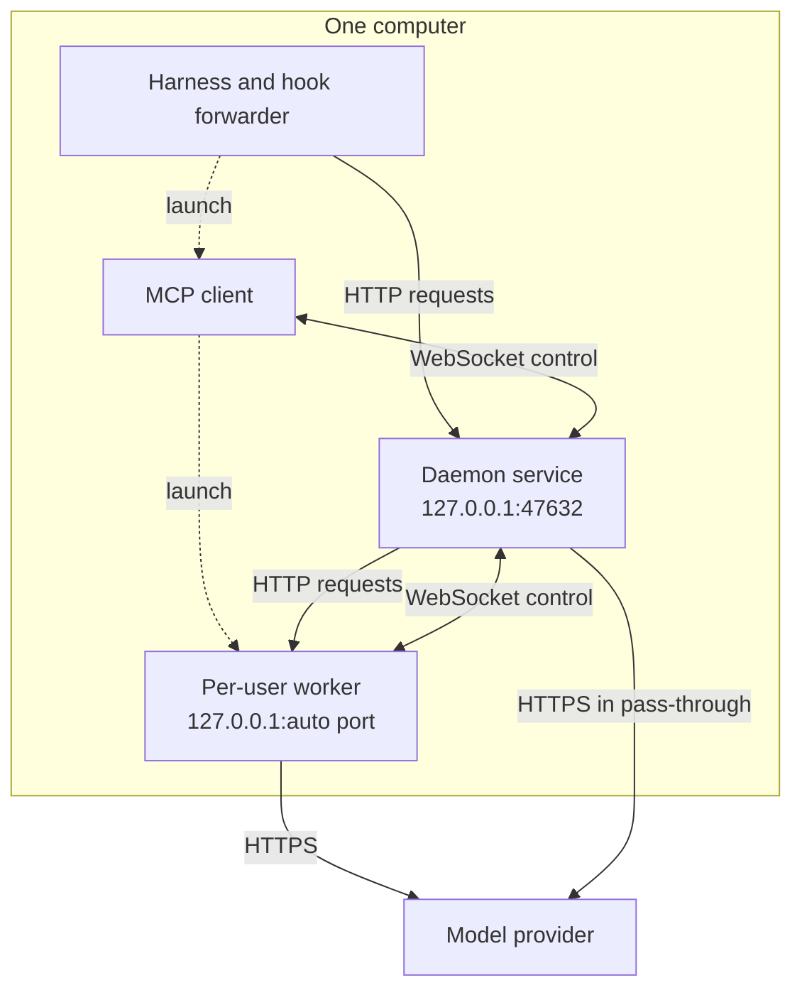
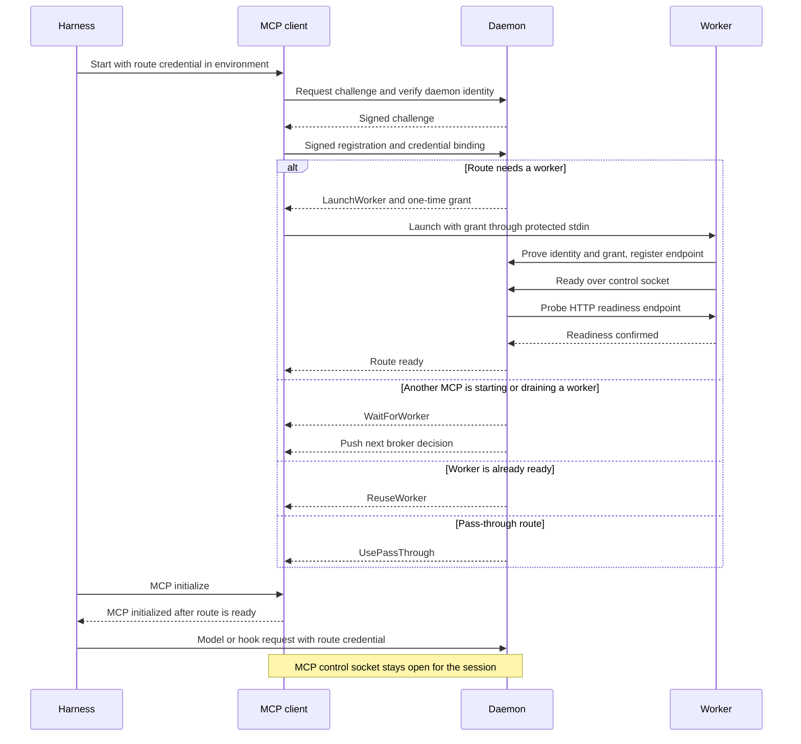
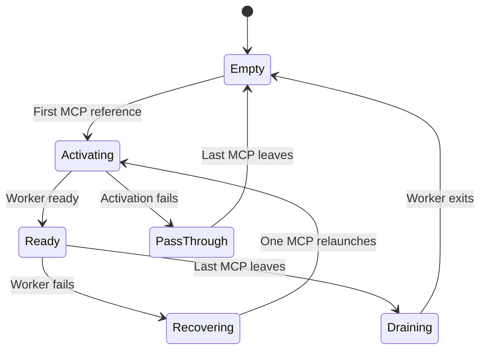

{/* SPDX-FileCopyrightText: Copyright (c) 2026, NVIDIA CORPORATION & AFFILIATES. All rights reserved.
SPDX-License-Identifier: Apache-2.0 */}

On narrow screens, scroll diagrams horizontally to read every label.

## Process Roles

The harness launches `nemo-relay daemon mcp` as a Model Context Protocol (MCP)
process over standard input and output. This MCP connection keeps a reference
open with the daemon. It provides no tools. The daemon's **broker** decides
whether the user-machine route needs a new worker or can share an existing one.

The MCP process starts a worker on the **client computer** only when the broker
instructs it to. The worker loads the administrator's system configuration and
plugins. Install the daemon as a service; do not install MCP or workers as services.

```mermaid
flowchart TD
    H["Coding harness<br/>Codex, Claude Code, or Pi"]
    M["MCP lifecycle client"]
    F["Short-lived hook forwarder"]
    D["Daemon and route broker"]
    W["Worker for one machine-user"]
    P["Model provider"]
    H -. "launch and MCP stdio" .-> M
    H -. "launch with hook payload" .-> F
    M <-->|"WebSocket lifecycle and control"| D
    M -. "launch with protected grant" .-> W
    W <-->|"WebSocket lifecycle and control"| D
    H -->|"model requests"| D
    F -->|"hook requests"| D
    D -->|"authenticated requests"| W
    W -->|"model requests"| P
    D -->|"model requests in pass-through"| P
```

Dotted arrows show process startup. Solid arrows show communication; responses
return along the request path. Model streams travel back through the worker and
daemon to the harness. Hook responses return through the hook forwarder.
The harness and hook forwarder do not contact a worker directly.

MCP and worker processes each open a persistent WebSocket control session to the
daemon. The daemon pushes route decisions and drain commands on those sessions.
Model and hook traffic use separate HTTP connections.

## Local Deployment

A system daemon has its own service identity. Each user's MCP and worker use that
user's identity. Several harness sessions for the same identity share one worker.
Different users do not share runtime state. The default worker port is assigned
by the operating system; there is no worker service to enable at login.

## Initialization Sequence

The harness may send its MCP initialize message earlier; Relay does not serve
the MCP protocol until it has acquired a usable route. A waiting client follows
later broker decisions before completing startup. If worker activation fails
after authentication, the route can become pass-through. MCP readiness alone
does not prove that a worker is running.

## Shutdown and Recovery

The diagram shows the main transitions. Explicit `--pass-through` never launches
a worker. A draining worker cannot be revived; new MCP clients wait for it to
exit. Accepted requests have up to two minutes to finish. Workers also stop
accepting new requests if they lose authenticated daemon control.

See [Identity and Lifecycle](/daemon/reference#understand-broker-identity-and-lifecycle)
for reconnect grace, remote keepalive timing, restart recovery, and all broker states.
