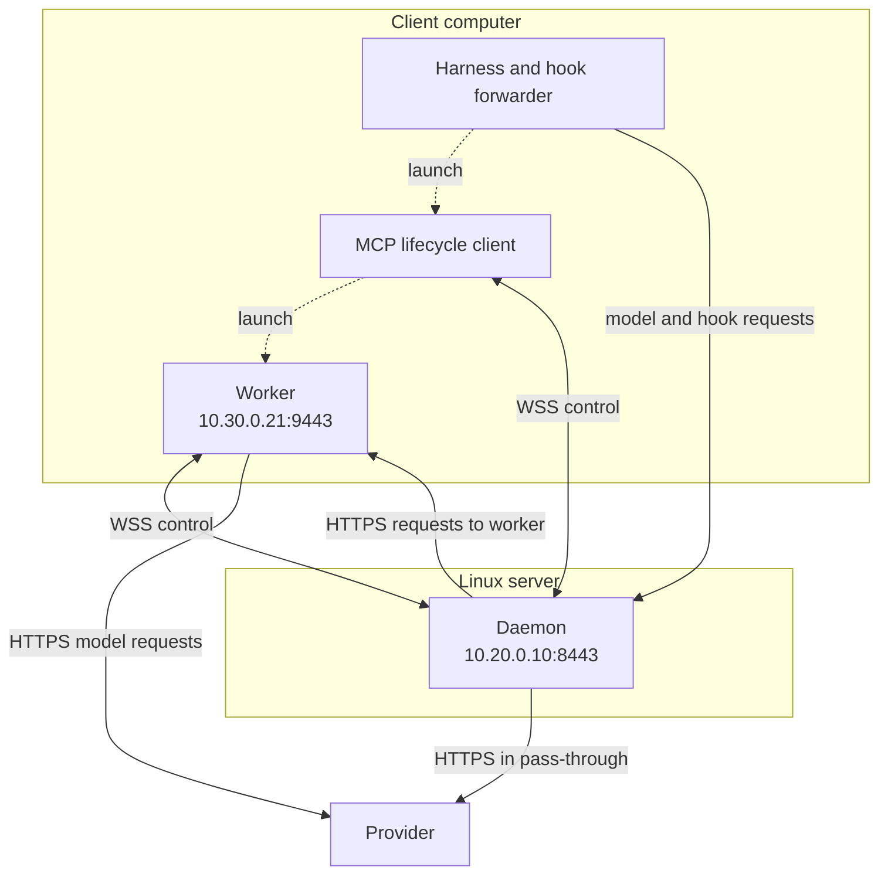

{/* SPDX-FileCopyrightText: Copyright (c) 2026, NVIDIA CORPORATION & AFFILIATES. All rights reserved.
SPDX-License-Identifier: Apache-2.0 */}

This runbook uses a Debian or Ubuntu server with systemd and an existing private
LAN or VPN. The server runs the daemon. Each client runs its own harness, MCP
process, and worker. Install system plugin configuration on **every client**;
putting it only on the server does not configure remote workers.

On narrow screens, scroll diagrams horizontally to read every label.

## Plan Addresses and Connections

Replace these example values consistently before generating the bundle:

| Setting | Example |
| --- | --- |
| Daemon DNS name | `relay.example.com` |
| Daemon private IPv4 address | `10.20.0.10` |
| Daemon origin | `https://relay.example.com:8443` |
| Allowed client network | `10.30.0.0/24` |
| Example client IPv4 address | `10.30.0.21` |
| Example worker port | `9443` |

<div role="region" aria-label="Remote deployment diagram" tabIndex={0} style={{ overflowX: "auto" }}>
<div style={{ minWidth: "760px" }}>



</div>
</div>

Responses use the same connections in reverse. The daemon opens a **new inbound
connection to the client worker**. This is not a reverse tunnel.

| Initiator | Destination | Purpose |
| --- | --- | --- |
| Client harness, hooks, MCP, worker | Daemon TCP 8443 | HTTPS requests and WSS control sessions |
| Daemon | Assigned client worker TCP port | HTTPS readiness checks and routed requests |
| Client worker | Configured provider, normally TCP 443 | Model requests |
| Daemon | Configured provider, normally TCP 443 | Pass-through requests |
| Server and clients | Organization DNS and certificate services | Name resolution and trust provisioning |

Allow these paths through host firewalls, VPN rules, and network access controls.
Clients must resolve `relay.example.com` to the private server address. The daemon
must resolve or route to each worker's advertised IPv4 address. Plain HTTP is
not accepted for a remote daemon origin. MCP and workers derive `wss` control
URLs from the configured `https` origin; no additional control port is required.
Firewalls and proxies must allow long-lived WebSocket sessions as well as HTTPS
requests. See [Reverse Proxy Requirements](/daemon/reference#configure-a-trusted-reverse-proxy).

## Install the Server

Install the verified CLI as `/opt/nvidia/bin/nemo-relay` and create the
`nemo-relay` service account and `/var/lib/nemo-relay/.config` directory using
[Linux Deployment](/daemon/linux#system-service). Do not enable the local unit;
use the remote unit below instead. If migrating an existing daemon, retain its
service account and state directory.

Provision `/etc/nemo-relay/config.toml` as described in
[Configuration](/daemon/configuration#system-configuration). Keep provider
routing consistent with the clients so pass-through reaches the intended
providers. Do not put users' route credentials on the server.

## Provision the HTTPS Certificate

Obtain a server certificate for `relay.example.com` from your organization's
certificate authority (CA), or a public CA trusted by all clients. The certificate
must include that name in its subject alternative names. Install the full server
certificate chain and an unencrypted PKCS#8 PEM private key. Protect the key with
filesystem permissions; the service must be able to read it without a prompt.

For an organization CA, create the key and certificate signing request on the
server. Run this in a root shell; it does not create a self-signed certificate:

```bash
sudo -i
install -d -o root -g nemo-relay -m 0750 /etc/nemo-relay/tls
umask 077
openssl genpkey -algorithm RSA -pkeyopt rsa_keygen_bits:3072 \
  -out /etc/nemo-relay/tls/server.pk8
openssl req -new -key /etc/nemo-relay/tls/server.pk8 \
  -out /etc/nemo-relay/tls/server.csr \
  -subj '/CN=relay.example.com' \
  -addext 'subjectAltName=DNS:relay.example.com'
exit
```

Submit `server.csr` through your CA process. Save the returned leaf certificate
followed by its intermediate certificates as `server-chain.pem`. Then install it
and grant the daemon group read access:

```bash
sudo install -o root -g nemo-relay -m 0640 server-chain.pem /etc/nemo-relay/tls/server-chain.pem
sudo chown root:nemo-relay /etc/nemo-relay/tls/server.pk8
sudo chmod 640 /etc/nemo-relay/tls/server.pk8
openssl x509 -in server-chain.pem -noout -subject -issuer -dates -ext subjectAltName
```

For a private CA, distribute its trusted root separately through the operating
system's trust store on each client. See the [client runbook](/daemon/remote-clients#trust-the-daemon-certificate).
Do not disable TLS verification. Worker TLS certificates are generated by Relay
and their trust is carried by the authenticated daemon connection; they do not
require a separate CA enrollment procedure.

## Install the Remote Service

Save `/etc/systemd/system/nemo-relay-daemon.service`:

```ini
[Unit]
Description=NeMo Relay remote daemon
Wants=network-online.target
After=network-online.target

[Service]
Type=simple
User=nemo-relay
Group=nemo-relay
WorkingDirectory=/var/lib/nemo-relay
Environment=XDG_CONFIG_HOME=/var/lib/nemo-relay/.config
ExecStart=/opt/nvidia/bin/nemo-relay daemon --bind 0.0.0.0 --port 8443 --advertise-address https://relay.example.com:8443 --tls-cert /etc/nemo-relay/tls/server-chain.pem --tls-key /etc/nemo-relay/tls/server.pk8
Restart=on-failure
RestartSec=5
UMask=0077
NoNewPrivileges=true
PrivateTmp=true
TimeoutStopSec=150

[Install]
WantedBy=multi-user.target
```

`0.0.0.0` listens on all IPv4 interfaces. It is not an address clients should use.
The advertised origin must be reachable and include the explicit port.

For a server already using UFW with a default-deny incoming policy, add the
specific client-network rule:

```bash
sudo ufw allow from 10.30.0.0/24 to 10.20.0.10 port 8443 proto tcp
sudo ufw status verbose
```

Check for broader existing rules that would also expose 8443. Preserve SSH and
other required administration access when configuring the firewall. If your
network uses a different firewall, apply the same source, destination, and port
restriction there. Enrollment is open to reachable clients that prove an identity;
that proof does not establish organization membership.

Start and inspect the daemon:

```bash
sudo chmod 644 /etc/systemd/system/nemo-relay-daemon.service
sudo systemctl daemon-reload
sudo systemctl enable --now nemo-relay-daemon.service
sudo systemctl status nemo-relay-daemon.service
sudo journalctl -u nemo-relay-daemon.service -n 50 --no-pager
ss -ltn 'sport = :8443'
```

## Hand Off to Client Administrators

Provide the daemon origin, allowed network, CA trust instructions, approved Relay
binary, system configuration, and immutable managed bundle. Provision the bundle's
SHA-256 through a separate trusted channel. Assign a worker port to each
machine-user on shared clients. Do not share one route credential across users
or clone machine identity files into client images.

Continue with [Remote Linux: Deploy Clients](/daemon/remote-clients). Validate a
real worker-backed session before opening access to more users. A server listener
check alone does not prove that the return path to a worker works.

## Operate and Remove

Use the system-service journal for daemon logs; ask the client administrator for
MCP and worker stderr logs. Follow [Operations](/daemon/operations) for upgrade,
restart, pass-through detection, and identity recovery.

Renew the certificate before expiry, install its chain and matching key with the
same permissions, then restart the service during a maintenance window. Preserve
the Relay signing identity; it is separate from the HTTPS certificate.

To retire the server, close client sessions, disable the system service using
[Linux removal steps](/daemon/linux#remove-the-service), and remove the example
firewall rule if it is no longer needed:

```bash
sudo ufw delete allow from 10.30.0.0/24 to 10.20.0.10 port 8443 proto tcp
```

Keep identity state for rollback. Distribute a new named bundle if the daemon
origin changes; do not rewrite an existing v1 bundle in place.
